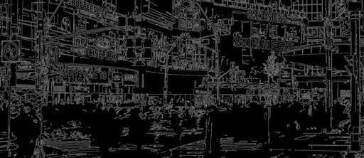

# chromavec

The chromavec library implements a set of image filters, specifically edge
detectors, that work with RGB colours directly.  Traditional edge detectors,
such as the [Canny edge detector](https://en.wikipedia.org/wiki/Canny_edge_detector),
are usually defined for greyscale images.  Doing edge detection on colour images
typically involves converting the colour image into greyscale and performing an
edge detection on **that**.  Now, that isn't to say that RGB edge detectors
don't exist, only that using them requires some custom implementation work.  It
also doesn't help that they way in which they're presented can be a bit
daunting.  More details can be found in the [documentation](https://richengguy.github.io/chromavec/).

The point of chromavec is to go from a full-colour image like this


to an edge map like this



without having to go from RGB to greyscale.  This seems like its a bit of a
minor point, especially since RGB to grey conversion isn't particularly
difficult to do. The problem is that information is lost in the conversion,
meaning that the edge map is for the *converted* image, not the original RGB
image.

The name of the library is a contraction of the words "chromatic vectors".  An
RGB colour triplet can be thought of as a 3D-vector, i.e. `(r, g, b)`.  That
means that are technically *chromatic* vectors because the word chromatic
[means](https://www.dictionary.com/browse/chromatic), "anything pertaining to
colour."

## Building

Chromavec uses a standard CMake project to manage the build process.  Provided
that the dependencies are available, creating a release build is
straightforward:

```
$ mkdir build
$ cd build
$ cmake -DCMAKE_BUILD_TYPE=Release /path/to/chromavec
$ make -j8
```

The archive file is in `build/lib` while the command line applications are in
`build/bin` and `build/test`.  The build system adds the following CMake flags:

Flag                 | Default   | Description
-------------------- | --------- | -----------
CHROMAVEC_BUILD_APPS | ON        | Build the CLI apps.
CHROMAVEC_BUILD_DOCS | OFF       | Build the chromavec documentation.

To build the documentation, enable the documentation flag and then run:

```
$ make docs
```

### Build Environment with Conda

To make setting up the build environment simpler, a
[conda environment file](https://docs.conda.io/projects/conda/en/latest/user-guide/tasks/manage-environments.html#creating-an-environment-from-an-environment-yml-file)
has been provided alongside the source code.  To create the environment:

```
$ conda env create
```

Once the dependencies have been retrieved, activate the environment by:

```
$ conda activate chromavec
```

It can be similarly deactivated by:

```
$ conda deactivate
```

### Dependencies

* OpenCV 3.4.2
* CMake 3.6 or higher
* Python 3.6 (optional)

Two other external libraries, [Intel TBB](https://github.com/01org/tbb/) and
[CLI11](https://github.com/CLIUtils/CLI11) are added as submodules and do not
have any other dependencies.  The CMake build system is aware of these
submodules and will run `git submodule update --init` automatically.

Python is only used for building the documentation.  If the documentation is
disabled then it is not required.

## Using chromavec

There are two ways to use chromavec: CLI applications or the API.

### CLI Applications

* `detect-edges`, which performs the Canny-style edge detection using RGB
  gradients.
* `apply-filter`, which applies the other colour-vector filters in the library.

Both expect an image and will produce another image.  The filter parameters are
passed in as command line options.

### API

The recommended way to include chromavec in another application is to add it an
existing CMake project using `add_subdirectory()` and adding the `chromavec`
target as a dependency using `target_link_libraries()`.  This will allow CMake
to add the correct include path to your project.

The various functions are all within the `chromavec` namespace.  They each
accept a `cv::Mat` and return the filtered image as a `cv::Mat`.  For example,
the sample below will apply the vector-range filter onto an image and return the
filter response:

```c++
#include <chromavec/chromavec.h>

// ... application code ... //

cv::Mat filtered = chromavec::VectorRangeFilter(img, window_size);
```

## Licence

Please note that the source code and documentation are licenced *seperately*.
The source code falls under a BSD 3-Clause licence while the documentation,
which is anything in the `docs/` folder, falls under a [CC-BY-SA-4.0](http://creativecommons.org/licenses/by-sa/4.0/) licence.
