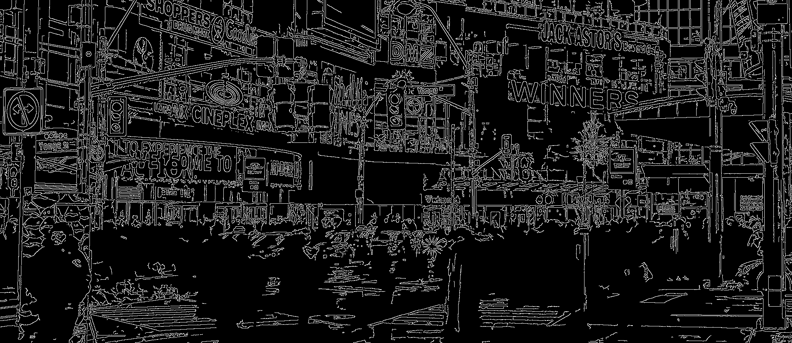

Colour Edge Filtering
=====================

The `chromavec` library implements a set of filters that can perform edge
detection directly on RGB images without first having to go through an RGB to
greyscale conversion.  This document provides information about the library and
the underlying theory.  The goal is to go from an RGB image such as this

.. figure:: img/yonge-dundas.jpg
    :scale: 30%

to an edge map

*without* any colour to grey conversions.

The code accompanying this document is available on
`Github <https://www.github.com/richengguy/chromavec>`_.

Sections
--------
.. toctree::
    :maxdepth: 1

    intro
    vector-order-statistics
    colour-gradients
    api
    references

Licensing
---------

This document is licensed under a |ccicon|_
`Creative Commons Attribution-ShareAlike 4.0 International License <http://creativecommons.org/licenses/by-sa/4.0/>`_.

.. |ccicon| image:: https://i.creativecommons.org/l/by-sa/4.0/80x15.png
.. _ccicon: http://creativecommons.org/licenses/by-sa/4.0/
