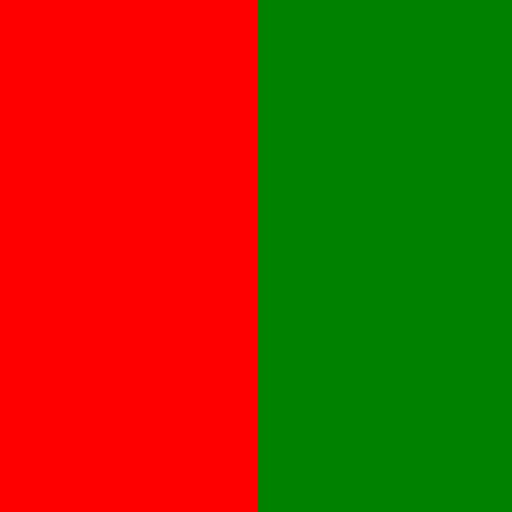

============
Introduction
============

When dealing with colour images, many image processing operations assume that
the colour channels can be either a) processed independently or b) converted
into greyscale.  Basically, the assumption is that an image is either black and
white or that it can be treated as three separate black and white images.  For a
lot of operations, this is actually pretty reasonable.  For example, when you're
blurring an image, the underlying math doesn't care if an image is colour or
greyscale.  Things start breaking down when the math *does* care.

Pixel Values
============

A digital image is essentially a :math:`\mathrm{height}\times\mathrm{width}`
grid where each element :math:`I[x,y]` contains a *single* value.  For a
greyscale image, each cell contains only a single value.  In most cases [#f1]_
the image values range between 0 and 255 in discrete steps.  That's because
for 8-bit images, the maximum possible value is :math:`2^8-1 = 255`.

Things are a little bit different for colour images because each pixel now has
*multiple* values associated with it.  The easiest way to think about it is that
a typical red, green and blue (RGB) image are three separate images joined
together.  That means that each pixel at position :math:`[x,y]` contains a
*triplet* instead of just one value.  So, a bit more formally, a greyscale image
is :math:`I[x,y] = c`, where :math:`0 \le c \le 255`.  A colour image is
:math:`I[x,y] = (r,g,b)` where :math:`0 \le r, g, b \le 255`.

Wikipedia provides a good overview of this on their
`Grayscale <https://en.wikipedia.org/wiki/Grayscale>`_ page.

From Colour to Greyscale
========================

Okay, so that still doesn't answer the question, "why do we care?"  The short
answer is that sometimes we want to be able to compare different parts of the
same image.  We usually do this by looking at pixel values and seeing the
difference between a pixel at :math:`[x_1, y_1]` with a pixel at
:math:`[x_2, y_2]`.

Things get a
bit more interesting when you consider how an RGB image becomes a greyscale
image.  In theory, the conversion is pretty simple.  And it is.  The grey value
of any pixel is just a weighted sum of its RGB values [#f2]_.  The default in
OpenCV [#f3]_ uses weights that preserve the relative "brightness" of the
colours and is given by

.. math::

    Y = 0.299R + 0.587G + 0.114B.

The reason why this variable is labelled :math:`Y` is because it comes from the
YUV/YCbCr colour representations.

Anyway, the key thing is that a colour to grey conversion is a dot-product
between two vectors.  Or, put another way, the projection of a 3D vector space
onto a 1D subspace.  Or, minus the math-speak, taking three separate values and
reducing it into a single value.  However you put it, you're taking a bunch of
numbers and turning it into a single number.  By definition, you're loosing some
information, and this is where weird things start happening.

When Things Break
=================

Consider this image:

    An image with red on the left side, green on the right side.

One side of it is a dark red and the otherside is a dark green.  There's an
edge running right down the middle of it.  Now, consider loading that image and
converting into greyscale using the following code example:

.. code-block:: cpp
    :linenos:

    #include <opencv2/imgproc.hpp>
    #include <opencv2/imgcodec.hpp>

    int main(int nargs, char **args)
    {
        cv::Mat img = cv::imread(args[1]);
        cv::Mat grey;
        cv::cvtColor(img, grey, CV_BGR2GRAY);
        cv::imwrite(args[2], grey);
        return 0;
    }

The output is this image:

    Resulting greyscale image.

That's not a glitch.  Everything's working exactly as it's supposed to.  It's
just that the red and green values were chosen so that after converting to
greyscale, you get the exact same grey value.

So, what happened?  Well, let's set the blue value to zero.  That means that we
just need to worry about the red and green values.  This also lets the colour
to greyscale equation become

.. math::

    Y = 0.299R + 0.587G.

What we want to do is now figure what values of :math:`R` and :math:`G` will
give us the exact same value of :math:`Y`.  To do this, processing algorithms are essentially colour blind?we need to see what's
the largest value that :math:`Y` can have.  For a reason that will become
(hopefully) obvious shortly, the largest value of :math:`Y` that can be made
from red and green is

.. math::

    Y = \lfloor 0.299*255 \rfloor = 76.

So, we need to produce a value of 76.  Figuring out what the red and green
values will need to be can be done by solving a system of simultaneous
equations.  We set it up like so:

.. math::

    76 &= 0.299*R_1 + 0.587*G_1

    76 &= 0.299*R_2 + 0.587*G_2

To keep things simple(r), let :math:`R_1 = 0` and :math:`G_2 = 0`.  That means
that

.. math::

    76 &= 0.587*G_1

    76 &= 0.299*R_2

Finding the values is just a matter of dividing 76 by the appropriate value and
then rounding *down*.  In other words,

.. math::

    G_1 = \left \lfloor \frac{76}{0.587} \right \rfloor = 129

    R_2 = \left \lfloor \frac{76}{0.299} \right \rfloor = 254

Now, the reason for choosing :math:`Y=76` should be a bit more apparent.  The
colour values have to be between 0 and 255 (or some predefined maximum value) so
choosing the *larger* of the two would mean that :math:`R_2 = 500` [#f4]_.

What can we do?
===============

Okay, so by now it should be obvious that converting an RGB image into a
greyscale image has...problems.  Does that mean that things are hopeless?  That
we just have to accept the ambiguities that come when converting to greyscale?
Well, no, we don't.  And the fact is that dealing with colour isn't particularly
difficult.

The rest of this document/website will discuss one way to use colour information
to find image edges.  There are others and it's a topic that has been studied a
fair bit.  This project was primarily inspired by the work of Lukac et al. on
colour image filtering using vector order statistics [lukac2005]_.  The section
on :doc:`colour-gradients` is closely related to the work by [scharcanski1997]_,
which also has some basis in vector order statistics. There are other
approaches, including ones based more on calculus then on statistics, but those
won't be discussed here.

.. rubric:: Footnotes

.. [#f1] Actually, that's not quite true since the maximum value depends on a
         number of things, such as how the image was captured and stored.  A
         good example are RAW images: the pixel values will be between 0 and
         whatever the maximum bit-depth used by the camera's sensor.  Images can
         also be represented using floating-point numbers and in that case they
         usually are between 0 and 1.

.. [#f2] The way that you choose the weights can have an effect on how the final
         greyscale image appears.  That's what the adjustment sliders in
         `Adobe Lightroom <https://helpx.adobe.com/ca/lightroom/how-to/convert-photo-black-white.html>`_
         do, for example, in their "black & white" panel.

.. [#f3] See the "RGB <--> GRAY" section in the
         `Color Conversion <https://docs.opencv.org/3.4.2/de/d25/imgproc_color_conversions.html>`_
         in the OpenCV documentation.

.. [#f4] Proving this is left as an exercise for the reader.
