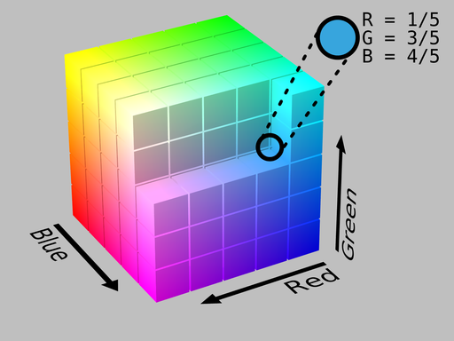
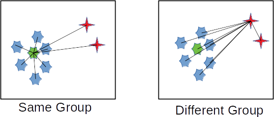
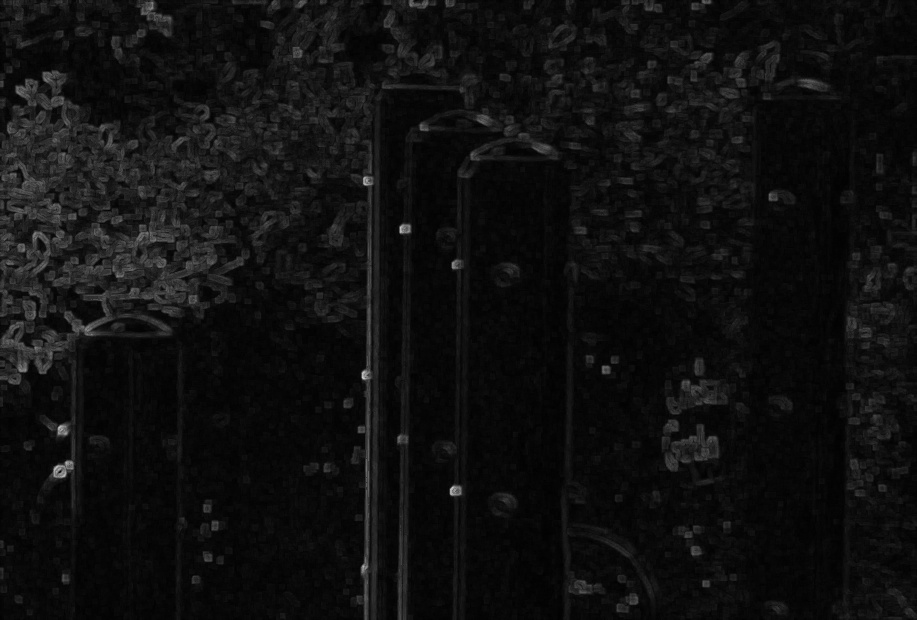
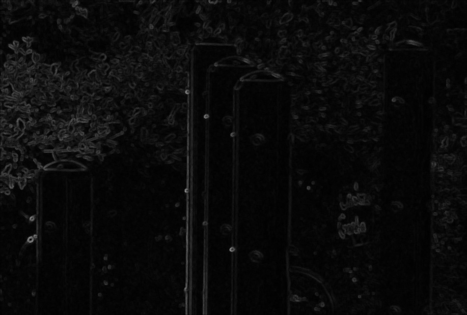

=======================
Vector Order Statistics
=======================

This section will look at colour image filtering using a technique known as
vector order statistics.  This is what was done by Lukac et al. [lukac2005]_ in
their work on colour image filtering.  However, before talking about that, we'll
take a little bit of time to discuss how "normal" filtering is done (i.e.
convolution or kernel filtering) to provide something to compare against.  After
that, we can look at how explicitly adding in colour information changes things.

Convolution-based Filtering
===========================

The most basic type of image filtering, ones that don't just brighten or darken
pixel values, are based on the
`convolution operator <https://en.wikipedia.org/wiki/Convolution>`_.  While the
underlying theory is quite deep, the basic idea is really simple: it's a
weighted, moving average.  That's it.  In fact, the mathematical expression for
*any* convolution is [#f1]_ [#f2]_

.. math::

    I[x,y] * h[i,j] = \sum_{i=-w}^{w} \sum_{j=-h}^{h} I[i - x, j - y] h[i, j].

What this tells us is that for any pixel at :math:`[x,y]`, we take the weighted
average in some window around that pixel.  To keep things simple, assume that
the window is :math:`2w + 1` pixels wide and :math:`2h + 1` pixels tall.

A whole range of filters [#f3]_ can be implemented just by carefully choosing
the values of :math:`h[i,j]`.  For example,

.. math::

    h[i,j] = \begin{bmatrix}
        \frac{1}{3} & \frac{1}{3} & \frac{1}{3} \\
        \frac{1}{3} & \frac{1}{3} & \frac{1}{3} \\
        \frac{1}{3} & \frac{1}{3} & \frac{1}{3}
    \end{bmatrix}

is a 3x3 moving average box (blur) filter while

.. math::

    h[i,j] = \begin{bmatrix}
         0 & -1  &  0 \\
        -1 &  4  & -1 \\
         0 & -1  &  0
    \end{bmatrix}

is a `Laplacian filter <https://homepages.inf.ed.ac.uk/rbf/HIPR2/log.htm>`_.
Blurring filters are created by making all of the values in :math:`h[i,j]` add
up to one while edge detectors (usually) have the values add up to zero.

Filtering greyscale images is basically applying the convolution equation onto
the image directly.  When working with colour images, the same operation
is applied onto the red, green and blue colours independently.  This is because
the image is being treated as three *separate* images.  This makes sense for
blurring since you intuitively expect that a blur will affect each colour in the
exact same way.  If it doesn't then you start getting artifacts around colour
transitions.

Things are a bit different if you're trying to detect transistions (edges) in an
image.  The three "images" inside of a colour images are very similar but not
*identical*.  This bit is crucial to remember because a transition in the red
channel doesn't necessarily exist in the blue channel.  For example, pure yellow
is :math:`(255, 255, 0)`.  A yellow-red edge would appear as

.. math::

    \underbrace{(255, 255, 0)}_{\mathrm{yellow}}
    \to
    \underbrace{(255, 0, 0)}_{\mathrm{red}} =
    \underbrace{(0, -255, 0)}_{\mathrm{difference}}

when looking at the pixel values.  Only the green value changes, dropping from
255 to 0 across the edge.  It's clear that there's a change but it's harder to
intepret then if it was just a single value.  Why is this the case?

Well, let's look at the following 3x3 grid:

.. math::

    \begin{array}{|c|c|c|}
        \hline
        0 & 0 & 255 \\
        \hline
        0 & 0 & 255 \\
        \hline
        0 & 0 & 255 \\
        \hline
    \end{array}

The left side is black and the right side is white.  That means that if you
used the following filter :math:`h[i,j] = \begin{bmatrix} 1 & -1 & 0 \end{bmatrix}`
then the output [#f4]_ will be

.. math::

    \begin{array}{|c|c|c|}
        \hline
        0 & 255 & 0 \\
        \hline
        0 & 255 & 0 \\
        \hline
        0 & 255 & 0 \\
        \hline
    \end{array}

The jump in the middle is pretty obvious.  Now, let's repeat that with the
red-yellow edge from before.  The input grid looks like

.. math::

    \begin{array}{|c|c|c|}
        \hline
        (255, 255, 0) & (255, 255, 0) & (255, 0, 0) \\
        \hline
        (255, 255, 0) & (255, 255, 0) & (255, 0, 0) \\
        \hline
        (255, 255, 0) & (255, 255, 0) & (255, 0, 0) \\
        \hline
    \end{array}

and the output is

.. math::

    \begin{array}{|c|c|c|}
        \hline
        (0, 0, 0) & (0, -255, 0) & (0, 0, 0) \\
        \hline
        (0, 0, 0) & (0, -255, 0) & (0, 0, 0) \\
        \hline
        (0, 0, 0) & (0, -255, 0) & (0, 0, 0) \\
        \hline
    \end{array}

Now, just looking at the grid, it's obvious there's a jump.  It's clear that
"nothing happens" in the left and right rows.  The middle one is the interesting
one.  However, we can't get that by looking at a single value.  We have to
consider all three values *together*.  This is where the "vector" in "vector
order statistics" comes in.

Colours as Vectors
==================

This idea is pretty simple and actually how colour spaces are defined.  In a
vector-based colour model, each primary colour is a direction in the colour
space.  For the RGB colour space, the colours (conveniently) form a 3D cube
where any particular :math:`(R, G, B)` triplet [#f5]_ is a coordinate somewhere
inside that cube.

    Example of an RGB colour cube.  Image by SharkD and obtained from
    `Wikimedia Commons <https://commons.wikimedia.org/wiki/File:RGB_Cube_Show_lowgamma_cutout_b.png>`_
    under a [CC BY-SA 3.0  (https://creativecommons.org/licenses/by-sa/3.0)]
    licence.

More formally, a greyscale image is a **scalar**-valued function while a colour
image is a **vector**-valued function.  We can still define basic mathematical
operations on vector-valued functions, i.e. addition and subtraction, but we
also lose a few things, like the notion of something being "less than" or
"greater than" something else.  But, the good news is that we still keep the
notion of whether or not two colours are the same.

While there are many, many ways to define how "close" two vectors are, the two
that we'll focus on are the Euclidean and Euclidean-squared distances.  The
Euclidean distance between two colours, :math:`\vec{c}_1` and :math:`\vec{c}_2`,
is just the Pythagorean equation

.. math::

    d(\vec{c}_1, \vec{c}_2) = \sqrt{(R_1 - R_2)^2 + (G_1 - G_2)^2 + (B_1 - B_2)^2}

while the Euclidean-squared distance is, unsurprisingly, that value squared, i.e.

.. math::

    d^2(\vec{c}_1, \vec{c}_2) = (R_1 - R_2)^2 + (G_1 - G_2)^2 + (B_1 - B_2)^2.

You can also take the "distance" of a vector on its own.  This is known as a
vector norm and, actually, the distances are just vector norms of the
*differences* between vectors.

Why define the Euclidean-squared distance/norm?  It's mainly a math trick (kind
of). Basically, if :math:`d(\vec{c}_1) < d(\vec{c}_2)` then
:math:`d^2(\vec{c}_1) < d^2(\vec{c}_2)`.  The relative ordering is preserved and
is a lot easier to calculate than the Euclidean-squared norm than the
Euclidean-norm. The square-root also has some unpleasant side-effects but that's
not as important in this application.

Ordering Vectors
================

Okay, so we've talked about window-based (convolution) filtering and then
colours as vectors.  The next part is doing something with that information. One
way to use colour vectors directly is through order statistics.  Order
statistics are things like medians or minimum and maximum.  Basically, you take
a list, sort the values from smallest to largest and then see where certain
things fall. This tells you, for example, what's the most commonly occurring
value.

It isn't immediately obvious how to do this with vectors.  After all, how is
one vector "less than" another?  You can take its norm but an infinite number of
very different vectors have the same norm.  Well, one way, as this is what
Lukac et al. did, is to rank colours by their **aggregate distances**.  Again,
given some window around a pixel, the aggregate distance for any pixel *in* that
window is

.. math::

    D_i = \sum_j d(\vec{c}_i, \vec{c}_j).

Okay, so that's not exact that intuitive.  The equation is a bit dense but when
you draw it out, it becomes a bit more obvious what's going on.  Consider that
you have the following groups like what's shown in the image below.

    Example of aggregate distances.

What the equation calculates is how *central* a particular point is to all other
points.  When you calculate an aggregate distance, what you're actually doing is
figuring out how similar a point is to all other points.  The more similar it
is, the lower its aggregate distance.  When you generate and then sort a list of
these aggregate distances what you'll get are all of the most similar colours at
one end and the most dissimilar colours at the other end.

Filtering with Vectors
======================

Once you can rank vectors, you can now *filter* the vectors.  This is how Lukac
et al. create their colour image filters.  They assume that you can define a
distance between colours and then use that to rank colours from "most central"
to "least central.  So, for the rest of the section, given a window

.. math::

    \mathcal{W} = \left\{\vec{c}_0, \vec{c}_1, \dots, \vec{c}_{N-1} \right\},

assume that the colours have already been sorted so that

.. math::

    D_0 < D_1 < \cdots < D_{N-1}.

Vector Median
-------------

The easiest filter to understand is the vector median filter.  This filter is a
type of noise reduction (i.e. blur) filter that tries to remove "unlikely"
colours based on what's around it.  The underlying assumption is that most parts
of an image are "flat" and that they don't change all that much.  Sure, there
are edges but if you zoom in then in a 3x3, or 5x5 neighbourhood, the image will
look pretty much the same.  Or, put another way, it is locally homogeneous.

To that end, you can create a filter that just picks the colour with the
smallest aggregate distance, i.e.

.. math::

    \vec{c} = \vec{c}_0.

The reason why this is called the vector *median* is because if you take the
median of a bunch of numbers then what you get is the most occurring value.
And, because it acts like a median filter, it means that it will remove noise
(small colour fluctuations) while preserving large jumps.

.. figure:: img/vos/example.jpg
    :scale: 50%

    Input image.

    Output of the vector median filter with a 5x5 window.

Vector Range
------------

The vector range filter is defined as

.. math::

    r = d(\vec{c}_{0}, \vec{c}_{N-1})

which is just the distance between the most and least central vectors.  At
first, it's not obvious what it's doing.  But, consider what exactly the first
and last colours in that sorted list represent.

If the colours are all almost the same then the norm between the first and last
elements will be very small.  However, if there are multiple colours, which is
what happens along an edge, then this value gets larger.  That means that the
filter has a value close to zero when not near an edge and a non-zero value when
along an edge.  Which means that the vector range filter detects where an edge
is!  In fact, this is what the vector range filter is; it's a type of edge
detector.

.. figure:: img/vos/example.jpg
    :scale: 50%

    Input image.

    Output of the vector range filter with a 5x5 window.

Minimum Vector Dispersion
-------------------------

The minimum vector dispersion filter (MVDF) is a combination noise reduction
filter and edge detector.  The problem with pure edge detectors is that they're
very sensitive to noise.  This is just a result of creating a filter that
detects transitions.  One way to combat this is to merge an edge detector with
a blurring filter [#f6]_.

The MVDF is defined as

.. math::

    r = \min_j d \left(\vec{c}_{N-j}, \sum_{i=0}^{l-1} \frac{\vec{c}_i}{l} \right),

where

.. math::

    j \in \left\{ 0, 1, \dots, k \right\}, k, l < N.

That's a fair bit to take in so let's break it down a bit.  First, the

.. math::

    \sum_{i=0}^{l-1} \frac{\vec{c}_i}{l}

term is the average colour of the :math:`l`-most similar colours.  This is a
blurring operation because, well, you're taking the average of a set of colours.
This means that even if there are some small fluctations they'll get averaged
out.  If you set :math:`l=0` then this is just the vector median filter.

Next is the

.. math::

    \min_j d \left(\vec{c}_{N-j}, \cdot \right),

    j \in \left\{ 0, 1, \dots, k \right\}

What this says is that we're going to look at the :math:`k`-least similar
colours and then take the smallest of those distances.  The idea is that the
very last entry may be noise, so we want to ignore it if it is.  The result is
a filter that does a little bit of blurring and then tries to reject any noise
when computing the distances.  This is still an edge detector but the blurring
action means that it produces smoother edges and is less effected by noise.

.. figure:: img/vos/example.jpg
    :scale: 50%

    Input image.

    Output of the minimum vector dispersion filter where :math:`k=4`,
    :math:`l=3` and the window size was 5x5.

What's Next
===========

Next, we'll look at how we can take this sort of thinking and modify an existing
edge detection algorithm so that it's "colour-aware".  As it turns out, that's
not actually all that difficult once you start thinking about what it means to
find the colour distances.  We'll look at defining :doc:`colour-gradients` using
vector magnitudes rather than approximations to derivatives.

.. rubric:: Footnotes

.. [#f1] When talking about convolution, the convention is to represent it using
         the :math:`*` symbol.  It can be a little bit confusing since that's
         also the multiplication symbol.  For...reasons...convolution has
         properties that make it similar to a scalar-multiplication operation.

.. [#f2] If you go to the Wikipedia article, it talks about convolution on
         *continuous* functions.  That means you do integration.  Because images
         are *discrete* functions (2D sequences), then you do summations because
         it's the analogue to integration.

.. [#f3] A good example of different filter kernals can be found on the
         Wikipedia `Digital Image Processing <https://en.wikipedia.org/wiki/Digital_image_processing#Filtering>`_
         page.

.. [#f4] There are a variety of ways to handle the borders of an image.  One
         way, which usually works for visual effects, is to assume that the
         edges are replicated, so the border value just extends indefinitely.

.. [#f5] The RGB colour space is actually *horrible* for a lot of colour-based
         processing because it isn't perceptually uniform.  That means that
         colours don't behave the way you expect them to when in RGB space.
         A lot of algorithms will switch colour spaces, for example, to
         `CIE Lab <https://en.wikipedia.org/wiki/CIELAB_color_space>`_, to get
         around this problem.

.. [#f6] Edge detectors are a form of high-pass filter, which means that they
         allow in high-frequency signals.  Normally noise has high frequencies
         compared to the signal of interest.  A blur filter is a type of
         low-pass filter, which means that it can, usually, reject noise.  When
         you combine the two filters you end up with a band-pass filter that
         allows frequencies within a certain frequency band, or bandwidth.  By
         tuning the filter, you can select which frequencies you are interested
         in and which ones to reject.
